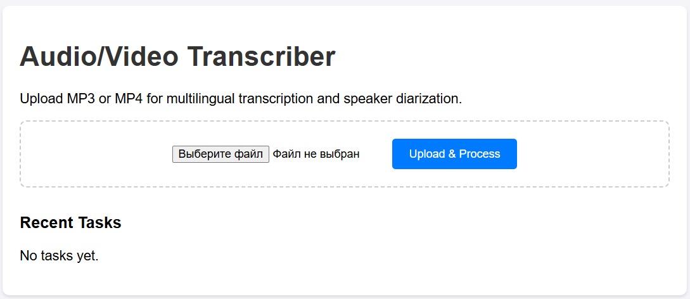

# Multilingual Audio/Video Transcriber with Speaker Diarization

This application allows you to upload audio and video files (MP3, MP4, WAV, M4A), transcribe them using OpenAI Whisper (via `faster-whisper`), and identify different speakers using `pyannote-audio`. It is designed to work locally with NVIDIA GPU (CUDA) support.


## Features
- **Multilingual Support**: Automatically detects and transcribes multiple languages (e.g., Russian and English) in the same audio file.
- **Speaker Diarization**: Identifies and labels different speakers in the transcription.
- **Background Processing**: Uses a task queue to process files in the background.
- **Local Execution**: No external API calls (like OpenAI API) are made for processing. All models run locally on your hardware.
- **High Performance**: Supports parallel transcription of speaker turns to fully utilize CPU/GPU resources.
- **Downloadable Results**: Results are available in TXT and JSON formats.

## Requirements
- Python 3.9+
- NVIDIA GPU with CUDA support (strongly recommended)
- FFmpeg installed on your system

## Installation

1. Clone the repository.
2. Install the dependencies:
   ```bash
   pip install -r requirements.txt
   ```
   *Note: By default, this may install the CPU-only version of PyTorch. If you have an NVIDIA GPU, see the [GPU Support](#gpu-support) section below.*

3. Install FFmpeg 7 (if not already installed).
   - Windows: `choco install ffmpeg` or visit https://winget-testing.com/BtbN.FFmpeg.GPL.7.1.html
   - Linux: `sudo apt install ffmpeg`

## GPU Support

To utilize your NVIDIA GPU for faster processing, you must ensure that the version of PyTorch installed is compatible with your CUDA version.

1. **Check your CUDA version**:
   Run `nvidia-smi` in your terminal to see your installed CUDA version.

2. **Install Torch with CUDA**:
   Go to the [official PyTorch website](https://pytorch.org/get-started/locally/) and select the command for your OS and CUDA version. For example, for CUDA 12.6/12.8/12.9:
   ```bash
   pip install torch torchaudio --index-url https://download.pytorch.org/whl/cu129
   ```

3. **Verify GPU availability**:
   You can verify if Torch sees your GPU by running:
   ```bash
   python -c "import torch; print(torch.cuda.is_available())"
   ```
   It should return `True`.

## Project Structure

- `app/`: Main application logic.
  - `main.py`: FastAPI application and API endpoints.
  - `processor.py`: Core logic for audio extraction, diarization, and transcription.
  - `models.py`: Pydantic models for API requests and responses.
  - `utils.py`: Helper functions for file handling and ID generation.
- `static/`: Frontend files (HTML, JavaScript).
- `uploads/`: Temporary storage for uploaded files.
- `outputs/`: Storage for transcription results (JSON and TXT).
- `requirements.txt`: Python dependencies.

## Configuration

Speaker diarization requires a Hugging Face token to download the pre-trained models.

1. Create a `.env` file from `.env.example`.
2. Get your Hugging Face token from [huggingface.co/settings/tokens](https://huggingface.co/settings/tokens).
3. Accept the user conditions for the following models on Hugging Face:
   - [pyannote/speaker-diarization-3.1](https://huggingface.co/pyannote/speaker-diarization-3.1)
   - [pyannote/segmentation-3.0](https://huggingface.co/pyannote/segmentation-3.0)
4. Add your token to the `.env` file:
   ```env
   HUGGING_FACE_HUB_TOKEN=your_token_here
   ```
5. (Optional) Adjust the number of parallel transcription workers in `.env`:
   ```env
   TRANSCRIPTION_WORKERS=2
   ```
   *Defaults to 2 for GPU and 4 for CPU.*

## Running the Application

You can start the FastAPI server using the provided scripts or manually:

### Using Scripts
- **Windows**: Double-click `run.bat` or run `.\run.bat` in your terminal. This script will automatically activate the virtual environment if it exists (`.venv` or `venv`) and install missing dependencies.
- **Linux/macOS**: Run `./run.sh` (you may need to give it execution permissions first: `chmod +x run.sh`). This script will automatically activate the virtual environment if it exists (`.venv` or `venv`) and install missing dependencies.

### Manually
```bash
python -m app.main
```
The application will be available at `http://localhost:8000`.

## Demo

A sample file `demo/en-ru-demo.m4a` is provided to test the multilingual transcription and speaker diarization capabilities. You can upload this file through the web interface to see the results.

## API Endpoints

The application provides several API endpoints for programmatic access:

- **POST `/api/upload`**: Upload an audio or video file. Returns a `task_id`.
- **GET `/api/status/{task_id}`**: Get the current status and progress of a task.
- **GET `/api/download/{task_id}?format={txt|json}`**: Download the transcription result. The downloaded file will have the same basename as the original uploaded file.
- **GET `/api/tasks`**: List all recent tasks.

## How it works
1. **Audio Extraction**: The uploaded file is converted to a 16kHz mono WAV file using FFmpeg.
2. **Diarization**: The `pyannote/speaker-diarization-3.1` model identifies speaker turns (who spoke when).
3. **Parallel Segmented Transcription**: Speaker turns are processed in parallel using `faster-whisper` (`large-v3` by default). This significantly speeds up the process on multi-core CPUs and GPUs while allowing the model to re-detect the language for each turn, ensuring that both Russian and English are captured correctly even in a single conversation.
4. **Final Assembly**: The transcriptions are combined into a single timeline with speaker labels and detected language tags.
